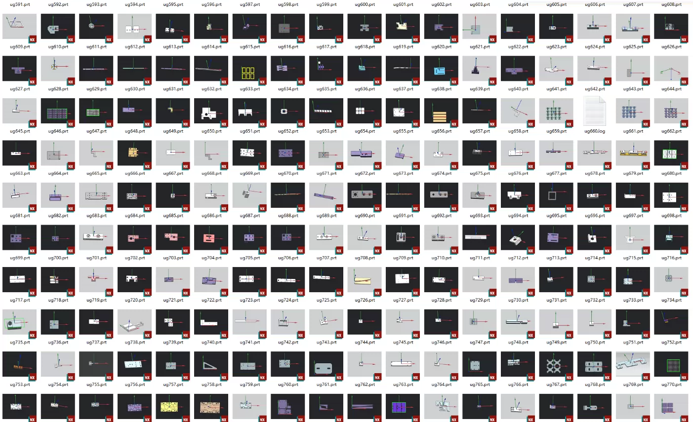

# UG10.0 Product Programming with Tool Path Practice Learning Drawings

## Body

UG10.0 is a popular 3D CAD software used for product design, manufacturing, and engineering analysis. It provides a comprehensive suite of tools for creating 3D models, simulations, and animations. In this context, "product programming" refers to the process of using UG10.0 to create and optimize the manufacturing processes for a specific product.

To learn how to program UG10.0 with cutting paths, you can follow these steps:

1. **Understand the Basics**: Before diving into programming, it's important to understand the basics of UG10.0. This includes learning about its interface, features, and capabilities. You can start by reading the official documentation or watching tutorials on YouTube.

2. **Learn About Cutting Paths**: Cutting paths are essential in 3D modeling as they define the path that the machine should follow during the machining process. In UG10.0, you can create cutting paths by selecting the toolpath feature and then defining the toolpath parameters such as the tool type, feed rate, spindle speed, etc.

3. **Create a New Project**: To start programming, you need to create a new project in UG10.0. This will give you a blank canvas to work on and store your files.

4. **Design Your Part**: Once you have created your part, you can start designing the cutting path. This involves selecting the appropriate toolpath feature and defining the parameters for each cut. You can use the toolbars provided by UG10.0 to help you create the cutting path.

5. **Test Your Cutting Path**: After designing your cutting path, you need to test it to ensure that it works correctly. You can do this by running a simulation or machining test. If the cutting path is not working as expected, you can adjust the parameters and try again.

6. **Review and Refine**: Finally, review your cutting path and refine it if necessary. Make sure that the cutting path is smooth, efficient, and meets the requirements of your product.

By following these steps, you can learn how to program UG10.0 with cutting paths and optimize your manufacturing processes for your products.

(Full product description was not available from the source page.)

## Images

## Payment

Here is a pay link on Stripe ( https://buy.stripe.com/3cs8yP7sY87d0vu9AB ). Please contact me lonlonago@foxmail.com after funding $89, and I will send you a complete data files , thank you!

